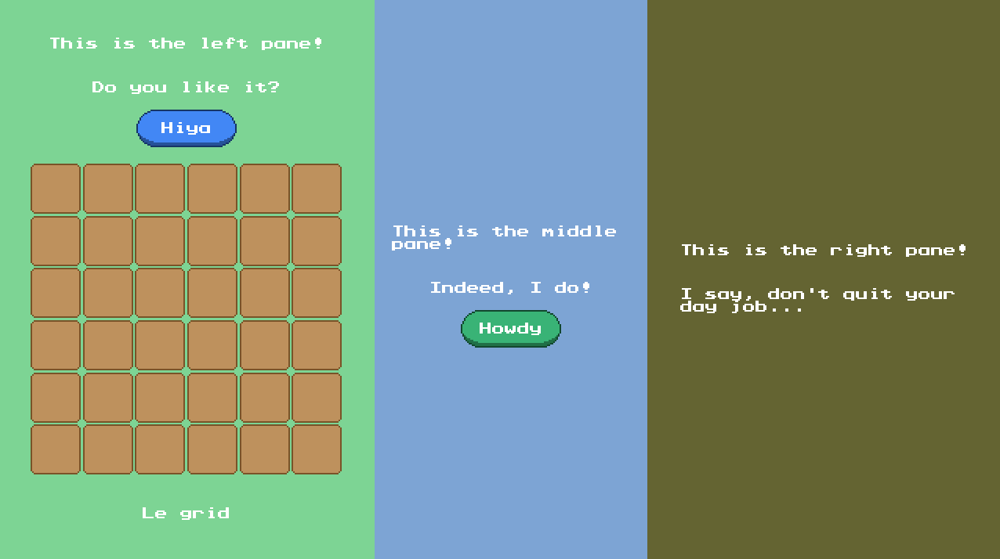

# NOTICE:
This crate will not be upgrading to the 0.15 version of Bevy for the forseeable future.
Historically, this crate relied on the various bundle types that came with Bevy.
Most, if not all have been deprecated at this point, making upgrading this crate difficult without major changes. 
That being said, I am open to PRs that can port the current functionality over without requiring
the use of these deprecated bundles.
I will keep an eye out.

# Bevy UI DSL

A tiny, plugin-less, macro-less "domain specific language" designed to make building UIs in Bevy more pleasant. This DSL uses the same ingredients that **bevy_ui** uses, so those already familiar with **bevy_ui** should have an easy time learning it.

## UI Example



```rust
use bevy_ui_dsl::*;

fn startup(mut commands: Commands, assets: Res<AssetServer>, mut scale: ResMut<UiScale>) {

    // Obligatory camera
    commands.spawn(Camera2dBundle::default());
    scale.0 = 2.0;

    // Spawns ui and gathers entity ids
    let mut hiya = None;
    let mut howdy = None;
    root(c_root, &assets, &mut commands, |p| {                                  // Spawns the root NodeBundle. AssetServer gets propagated.
        node((c_half, c_green), p, |p| {                                        // Spawns the left pane as a NodeBundle.
            text("This is the left pane!", c_text, c_pixel, p);                 // Spawns a TextBundle.
            text("Do you like it?", c_text, c_pixel, p);
            text_button("Hiya", c_button_left, c_pixel, p).set(&mut hiya);      // Spawns a ButtonBundle with a TextBundle child in the middle. Convenience widget.
            grid(6, 6, c_grid, p, |p, _row, _col| {                             // Spawns a NodeBundle container with a NodeBundle for each cell (6x6).
                image(c_inv_slot, p);
            });
            text("Le grid", c_text, c_pixel, p);
        });
        node((c_half, c_blue), p, |p| {
            text("This is the right pane!", c_text, c_pixel, p);
            text("Indeed, I do!", c_text, c_pixel, p);
            text_button("Howdy", c_button_right, c_pixel, p).set(&mut howdy);
        });
    });

    // Inserts marker components into the gathered entities.
    // Useful when you need to interact with specific entities in the UI.
    commands
        .entity(hiya.unwrap())
        .insert(UiId::HiyaButton);
    commands
        .entity(howdy.unwrap())
        .insert(UiId::HowdyButton);
}

```

This system spawns a UI using widgets like **root**, **node**, **text**, **text_button**, etc.
You can even create your own widgets! They're just functions! The callback approach is heavily inspired by [egui](https://github.com/emilk/egui).

In this example, **root** is a function that takes a class called **c_root**. The **c_root** function just manipulates a NodeBundle, which is NodeBundle::default() by default. Ultimately, the NodeBundle in question gets spawned.

Like **root**, **node** also takes in a class (or a tuple of classes) and spawns a NodeBundle. When a tuple of classes is supplied, the callback functions are applied in order of left to right.

Widget functions return the entity spawned. Through extension methods, these entity ids can be "escaped" so that components and bundles can be inserted later. This is great for separating the UI creation code from the bundle insertion code. There are two escape methods:
```rust
impl EntityWriter for Entity {
    /// Copies this entity into an Option.
    fn set(self, entity: &mut Option<Entity>) {
        *entity = Some(self);
    }
    /// Pushes a copy of this Entity into a Vec.
    fn push(self, entities: &mut Vec<Entity>) {
        entities.push(self);
    }
}
```

Oftentimes, though, it's easier to insert a marker component on the fly instead of inserting it later. For this reason, every built-in widget has an inline variant.
These variants accept an extra bundle as an argument.

| base          | inline        |
|---------------|---------------|
| root          | rooti         |
| blank         | blanki        |
| node          | nodei         |
| text          | texti         |
| button        | buttoni       |
| simple_button | simple_buttoni|
| text_button   | text_buttoni  |
| image         | imagei        |
| image_pane    | image_panei   |
| grid          | gridi         |

So, instead of:
```rust
text_button("Hiya", c_button_left, c_pixel, p).set(&mut hiya)
/// ... then later ...
commands.entity(hiya.unwrap()).insert(UiId::HiyaButton);
```
One can write:
```rust
text_buttoni("Hiya", c_button_left, c_pixel, UiId::HiyaButton);
```
Feel free to compare and constrast
[example.rs](examples/example.rs) with [example_inline.rs](examples/example_inline.rs). Which style you pick comes down to taste and situation. The "set" and "push" style is better when the insertion logic is complex and easily separatable. The "inline" style is better for marker components, as well as situations where separating the UI logic from the insertion logic is inconvenient.


## Class Examples

```rust
fn c_root(b: &mut NodeBundle) {
    b.style.width = Val::Percent(100.);
    b.style.height = Val::Percent(100.)
}

fn c_half(b: &mut NodeBundle) {
    let s = &mut b.style;
    s.width = Val::Percent(50.);
    s.height = Val::Percent(100.);
    s.flex_direction = FlexDirection::Column;
    s.justify_content = JustifyContent::Center;
    s.align_items = AlignItems::Center;
    s.padding = UiRect::all(Val::Px(10.));
}

fn c_green(b: &mut NodeBundle) {
    b.background_color = Color::rgb_u8(125, 212, 148).into();
}

fn c_blue(b: &mut NodeBundle) {
    b.background_color = Color::rgb_u8(125, 164, 212).into();
}

fn c_text(_a: &AssetServer, b: &mut TextBundle) {
    b.style.margin = UiRect::all(Val::Px(10.));
}

fn c_button_left(assets: &AssetServer, b: &mut ButtonBundle) {
    let s = &mut b.style;
    s.width = Val::Px(64.);
    s.height = Val::Px(24.);
    s.justify_content = JustifyContent::Center;
    s.align_items = AlignItems::Center;
    b.background_color = Color::rgb_u8(66, 135, 245).into();
    b.image = assets.load("button.png").into();
}

fn c_button_right(assets: &AssetServer, b: &mut ButtonBundle) {
    let s = &mut b.style;
    s.width = Val::Px(64.);
    s.height = Val::Px(24.);
    s.justify_content = JustifyContent::Center;
    s.align_items = AlignItems::Center;
    b.background_color = Color::rgb_u8(57, 179, 118).into();
    b.image = assets.load("button.png").into();
}

fn c_grid(b: &mut NodeBundle) {
    b.style.width = Val::Px(200.);
    b.style.height = Val::Px(200.);
    b.style.margin = UiRect::all(Val::Px(10.));
}

fn c_inv_slot(assets: &AssetServer, b: &mut ImageBundle) {
    b.style.width = Val::Px(32.);
    b.style.height = Val::Px(32.);
    b.image = assets.load("item_slot.png").into();
}

fn c_pixel(assets: &AssetServer, s: &mut TextStyle) {
    s.font = assets.load("prstartk.ttf").into();
    s.font_size = 8.;
    s.color = Color::WHITE.into();
}
```

Some classes only depend a single bundle. Others depend on an AssetServer to manipulate their respective types.
It is recommended that you only set the fields you wish to overwrite in your classes. Be careful, for instance, of using ```..default()``` as this will overwrite even the fields you don't specify. This is very bad when combining classes using the tuple syntax.

## Class Helpers
To make creating classes a little less verbose, there is an optional module you can import called **class_helpers**.
This module is made available by enabling the feature flag **class_helpers** in your Cargo.toml file. It includes various helper functions and constants to make your life easier. It is recommended that you put your class functions in their own module when using these helpers to avoid namespace pollution with the rest of your UI code.

```rust
use bevy_ui_dsl::*;
use bevy_ui_dsl::class_helpers::*;

fn c_node(b: &mut NodeBundle) {
    let s = &mut b.style;
    s.width = pc(50);
    s.height = pc(50);
    s.flex_direction = COLUMN;
    s.justify_content = JUSTIFY_CENTER;
    s.align_items = ALIGN_CENTER;
    s.padding = all(px(10));
}
```


## Widget Example
Creating a widget is just a matter of creating a function that follows a certain convention. No more, no less. It will usually require a **Class<T>** or **AssetClass<T>** (can be a callback function, or tuple of callback functions), a parent (needed to spawn the widget itself), and, for container widgets, a callback function used to spawn children of the widget. See [widgets.rs](src/widgets.rs) for examples.
```rust
/// Spawns a [`NodeBundle`] with children.
pub fn node(
    class: impl Class<NodeBundle>,              // Class (or classes) that manipulate the bundle.
    parent: &mut UiChildBuilder,                // Parent entity to add NodeBundle to.
    children: impl FnOnce(&mut UiChildBuilder)  // Callback function that spawns children of the newly spawned NodeBundle.
) -> Entity {
    let mut bundle = NodeBundle::default();             // Initializes the NodeBundle.
    class.apply(&mut bundle);                           // Applies class (or classes) to that bundle.
    parent.spawn(bundle).with_children(children).id()   // Spawns updated bundle with children!
}

```

## Compatibility

| bevy | bevy-ui-dsl |
| ---- | ----------- |
| 0.14 | 0.9         |
| 0.13 | 0.8         |
| 0.12 | 0.7 - 0.7.1 |
| 0.11 | 0.5 - 0.6   |
| 0.10 | 0.3 - 0.4   |
| 0.9  | 0.1 - 0.2   |
